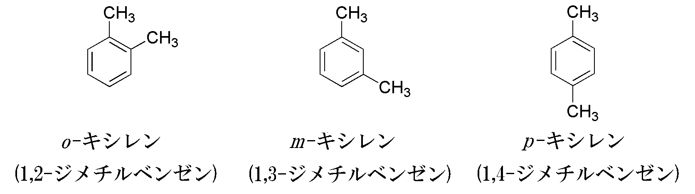

.. include:: def.txt
.. include:: def-webmo.txt

**********************
量子化学計算の基礎演習
**********************

ホルムアルデヒドの電子状態計算
==============================

はじめに、ホルムアルデヒド(formaldehyde; CH\ :sub:`2`\ O)の電子状態を計算してみる。
原子の座標を固定した計算を1点(single point)計算とよぶ。
本演習では、量子化学計算プログラムに *Gaussian* を使用する。

ホルムアルデヒドの化学的性質
----------------------------

ホルムアルデヒドの化学的性質をおさえておく。

- ホルムアルデヒド

  - 化学式: CH\ :sub:`2`\ O
  - 水に可溶: → 極性分子

|html_break|

演習
^^^^

ホルムアルデヒドの全エネルギーを求める
""""""""""""""""""""""""""""""""""""""

+ 以下の内容をコピーしてメモ帳などにペーストし、適当な名前(例えば"CH2O.gjf")で保存する。

.. code-block:: none
   :linenos:
   :caption: CH2O.gjf

   #P B3LYP/6-31G(d) SP Pop=Full GFInput

   CH2O

   0 1
   C  0.00000000  0.00000000  0.00000000
   O  0.00000000  0.00000000  1.20651800
   H  0.00000000  0.93772900 -0.59467900
   H -0.00000000 -0.93772900 -0.59467900

+ WebMOの"Job Manager"で、 :menuselection:`New Job --> Execute Input File` を選択する。"Execute Input File" に移る。
+ :guilabel:`Input File` タブで、下部にある :guilabel:`ファイルを選択` ボタンから、上記で保存したファイルを選択してアップロードする。内容が正しくアップロードされているか確認する。
+ :guilabel:`Job Name` には任意の名前(例えば"CH2O sp")を入力する。
+ :guilabel:`Choose Engine` タブをクリックし、Engineとして"Gaussian"を選択する。
+ :guilabel:`Choose Engine` タブは自由にメモが書き込める(入力しなくても良い)。
+ :guilabel:`Execute Job` ボタンをクリックすると計算が "Job Manager" に登録され、実行される。
+ "Job Manager" の該当するジョブが計算完了("Complete")したのを確認する。 未完了の場合は、 |webmo-refresh-icon| :guilabel:`Refresh` をクリックしてジョブの状況を随時更新する。
+ 該当するジョブの |webmo-output-icon| をクリックして、計算結果を確認する。
+ 全エネルギーは "Calculated Quantities"の"Overview"にある、"RB3LYP Energy"に記載されている。

ホルムアルデヒドの双極子モーメントを表示する
""""""""""""""""""""""""""""""""""""""""""""

- "Overview"の”Dipole Moment"にある |webmo-output-icon| をクリックする。ホルムアルデヒドの場合、炭素から酸素へ矢印が描かれていることを確認する。

ホルムアルデヒドの分子軌道を表示する
""""""""""""""""""""""""""""""""""""

- "Molecular Orbitals" の |webmo-output-icon| をクリックすると、分子軌道が可視化される。
- "Orbital" はエネルギーが低い順番にナンバリングされている。
- "Occupancy" は該当する分子軌道に入っている電子数を表している。2つの電子が入っている分子軌道を占有軌道、電子が入っていない分子軌道を空軌道とよぶ。
- 最もエネルギーの高い占有軌道をHOMO (Highest Occupaied Molecular Orbital)、最もエネルギーの低い空軌道をLUMO (Lowest Unoccupaied Molecular Orbital)とよぶ。これらはフロンティア軌道ともよばれ、様々な化学反応に関与することが知られている。

ホルムアルデヒドの電子密度を表示する
""""""""""""""""""""""""""""""""""""

- "Electron density" の |webmo-output-icon| をクリックすると、等電子密度面が可視化される。

ホルムアルデヒドの静電ポテンシャルを表示する
""""""""""""""""""""""""""""""""""""""""""""

- "Electrostatic potential" の |webmo-output-icon| をクリックすると、分子表面に静電ポテンシャルが可視化される。

.. note::

   "Job Manager"に戻るには 左側の |webmo-home-icon| "Job Manager" をクリックする。

窒素分子(N\ :sub:`2`)のモデリングと構造最適化
=============================================

一点計算による構造最適化
""""""""""""""""""""""""""

0.8 Å から2.0 Å まで全エネルギーを計算し、横軸に原子間距離、縦軸に全エネルギーをプロットしてみる。
まずは、原子間距離を0.1 Å刻みで求め、極小値付近では0.1 Å刻みで、極小値を0.1 Åの桁まで求めよ。

.. note::

   最もエネルギーが低い原子座標を求めることを構造最適化計算とよぶ。

Gaussianによる構造最適化
""""""""""""""""""""""""""

2つの窒素原子を任意の距離に置き、Gaussianによる構造最適化計算を行う。
”Job Option" の "Calculation" にて、"Geometory Optimization" を選択して実行する。
得られた原子間距離とプロットによって得られた原子間距離が一致していることを確認する。

2原子分子の結合距離
===================

次の2原子分子をモデリングし、構造最適化を行う。各分子の全エネルギー、原子間距離、双極子モーメントを求めよ。

.. csv-table:: 2原子分子
   :header: "分子", "全エネルギー / a.u.", "原子間距離 / Å", "双極子モーメント / Debye"
   
   "N\ :sub:`2`", "", "", ""
   "CO", "", "", ""
   "O\ :sub:`2` (三重項酸素)", "", "", ""
   "O\ :sub:`2` (一重項酸素)", "", "", ""

.. note::

   三重項酸素、一重項酸素(Δ\ :sup:`1`)、一重項酸素(Σ\ :sup:`1`)の分子軌道ダイアグラムは次の通り。

   .. image:: ./img/Molekülorbital-Sauerstoff.png

炭化水素のモデリングと構造最適化
================================

以下の分子のモデリング並びに構造最適化計算を行う。
C-C結合距離と結合次数の関係を確認する。

.. csv-table:: 2原子分子
   :header: "分子", "全エネルギー / a.u.", "C-C 原子間距離 / Å"
   
   "C\ :sub:`2`\ H\ :sub:`6`", "", ""
   "C\ :sub:`2`\ H\ :sub:`4`", "", ""
   "C\ :sub:`2`\ H\ :sub:`2`", "", ""

環状分子のモデリングと構造最適化
================================

以下の分子のモデリング並びに構造最適化計算を行う。
C\ :sub:`6`\ H\ :sub:`6` はいわゆるベンゼンである。平面構造を取っているか確認する。

.. csv-table:: 環状分子
   :header: "分子", "全エネルギー / a.u.", "構造の特徴"
   
   "C\ :sub:`6`\ H\ :sub:`12`", "", ""
   "C\ :sub:`6`\ H\ :sub:`6`", "", ""

キシレン(xylene)幾何異性体のエネルギー比較
==========================================

キシレンには3種類の異性体、o-キシレン、m-キシレン、p-キシレンが存在する。
どの幾何異性体が安定か。また、その理由を考察すること。

.. csv-table:: キシレン
   :header: "分子", "全エネルギー / a.u.", "o-xyleneとのエネルギー差 / kcal mol\ :sup:`-1`"
   
   "o-xylene", "", "---"
   "m-xylene", "", ""
   "p-xylene", "", ""

