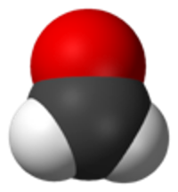

**********************
量子化学計算の基礎演習
**********************

ホルムアルデヒドの電子状態計算
==============================

はじめに、ホルムアルデヒド(formaldehyde; CH\ :sub:`2`\ O)の電子状態を計算してみます。
原子の座標を固定した計算を1点(single point)計算とよびます。
本演習では、量子化学計算プログラムに *Gaussian* を使用します。

ホルムアルデヒドの化学的性質
----------------------------

ホルムアルデヒドの化学的性質をおさえておきます。

- ホルムアルデヒド

  - 化学式: CH\ :sub:`2`\ O
  - 水に可溶: ということは極性分子です

.. image:: ./img/CH2O_chemstruct.png
   :align: right

課題
^^^^

ホルムアルデヒドの全エネルギーを求めよ。

窒素分子(N\ :sub:`2`)のモデリングと構造最適化
=============================================

0.8 Å から2.0 Å まで原子間距離を0.1 Å刻みで全エネルギーを計算しましょう。
最もエネルギーが低い距離が最安定構造となります。
